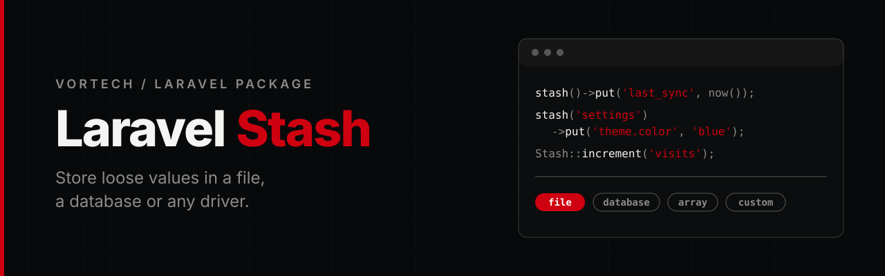

<p align="center">
  
</p>

<p align="center">
  <a href="https://github.com/Vortech-Group/stash/actions/workflows/run-tests.yml"></a>
  <a href="https://packagist.org/packages/vortech/laravel-stash"></a>
  <a href="https://packagist.org/packages/vortech/laravel-stash"></a>
  <a href="https://packagist.org/packages/vortech/laravel-stash"></a>
  
  <a href="LICENSE.md"></a>
</p>

<p align="center">
  Store and retrieve loose, non-sensitive values in a <strong>file, a database or any custom driver</strong>.<br>
  One small API, no matter where the data lives.
</p>

---

## Why

Some values do not deserve a table, a model or a migration: the time of the last sync, a feature flag, a visit counter, a small setting. Stash keeps them in named stashes behind a tiny API, and the storage is a driver you can swap without touching your code.

| | Config / `.env` | Cache | Stash |
|---|---|---|---|
| Writable at runtime | no | yes | yes |
| Survives cache flushes | yes | no | yes |
| Pick the storage per stash | no | per store | yes (`file`, `database`, `array`, custom) |
| Needs a migration | no | no | only for the database driver |

> **Do not store secrets or personal data in it.** Stash is meant for loose, non-sensitive values. The file driver writes plain JSON.

## Requirements

- PHP 8.4+
- Laravel 13

## Installation

```bash
composer require vortech/laravel-stash
```

The service provider and the `Stash` facade are registered automatically through package discovery.

Then run the install command to publish the config file:

```bash
php artisan stash:install
```

Use `--force` to overwrite an existing config file, and `--database` to also publish the migration of the database driver.

## Usage

```php
stash()->put('last_sync', now()->toIso8601String());   // the default stash
stash()->get('last_sync');

stash('settings')->put('theme.color', 'blue');         // a named stash, dot notation
stash('settings', ['a' => 1]);                          // create it with values

Stash::increment('visits');                             // the facade works on the default stash
Stash::store('settings')->all();
```

Everything goes through a **stash**: a named bag of key/value pairs. `stash()` returns the stash called `default`, `stash('settings')` returns the one called `settings`. Stashes are independent of each other.

Stash names may contain letters, numbers, `-`, `_` and `.` only. Anything else throws an `InvalidArgumentException`, because the name ends up in file names and queries.

### Methods

| Method | Description |
|---|---|
| `put($key, $value)` | Stores a value, or an array of `key => value` pairs. Dot notation is supported. |
| `get($key, $default)` | Gets a value. |
| `has($key)` | Whether the key exists. |
| `push($key, $value)` | Appends to a list. An existing scalar is turned into a list first. |
| `pull($key, $default)` | Gets a value and removes it. |
| `forget($keys)` | Removes one or more keys. |
| `remember($key, $callback)` | Gets a value, or stores and returns the callback result when it is missing. |
| `increment($key, $by)` / `decrement($key, $by)` | Changes a number (int or float). Throws on non-numeric values. |
| `all()` / `collect()` / `fluent($key)` | The whole stash as an array, a `Collection`, or a `Fluent` for one key. |
| `count()` | Number of keys. |
| `exists()` | Whether anything is persisted for this stash. |
| `flush()` | Removes the whole stash. |

Methods that change the stash return the stash, so they can be chained. A stash that becomes empty is removed from the storage (the file is deleted, the row is dropped).

In Blade, `@stash('key')` echoes a value of the default stash.

## Drivers

| Driver | Storage |
|---|---|
| `file` | `<STASH_PATH>/<name>.json`, the default |
| `database` | the `stash` table, one row per stash |
| `array` | in memory for the current process, handy in tests |

The default driver is set with `STASH_DRIVER`, or per call:

```php
stash('settings', driver: 'database')->put('a', 1);
Stash::store('settings', 'database')->get('a');
Stash::driver('database')->increment('visits');          // default stash on a driver
Stash::driver('database', 'settings')->get('a');         // named stash on a driver
```

### Database driver

Publish and run the migration:

```bash
php artisan stash:install --database
php artisan migrate
```

(`php artisan vendor:publish --tag=stash-migrations` does the same.)

The connection and the table name come from `STASH_DB_CONNECTION` and `STASH_DB_TABLE`.

### Custom drivers

Implement `Vortech\Stash\Contracts\Driver` and register it, for example in a service provider:

```php
use Vortech\Stash\Contracts\Driver;

final class RedisDriver implements Driver
{
    public function read(string $store): array { /* ... */ }
    public function write(string $store, array $values): void { /* ... */ }
    public function exists(string $store): bool { /* ... */ }
    public function delete(string $store): void { /* ... */ }
}

Stash::extend('redis', fn ($app) => new RedisDriver);
```

Then use it with `STASH_DRIVER=redis` or `stash('name', driver: 'redis')`.

## Configuration

Publish the config with `php artisan stash:install` (or `php artisan vendor:publish --tag=stash-config`), then edit `config/stash.php`:

| Key | Default | Description |
|---|---|---|
| `default` | `file` | The driver used when none is given (`STASH_DRIVER`). |
| `drivers.file.path` | `storage_path('stash')` | Directory of the JSON files (`STASH_PATH`). |
| `drivers.database.connection` | `null` | Database connection, `null` is the default one (`STASH_DB_CONNECTION`). |
| `drivers.database.table` | `stash` | Table name (`STASH_DB_TABLE`). |

## Good to know

- **Atomic file writes.** The file driver writes a temporary file and renames it, so a reader never sees a half-written file.
- **Corrupted data is an error, not silence.** Invalid JSON throws a `RuntimeException` instead of being treated as empty and overwritten.
- **No locking across requests.** Read-modify-write operations (`put`, `push`, `increment`) are not locked between concurrent requests. Writes are safe, but the last writer wins.

## Testing

```bash
composer test
```

The suite uses [Pest](https://pestphp.com) and requires PHP 8.4+ to run.

## Changelog

See [CHANGELOG](CHANGELOG.md) for what has changed recently.

## Contributing

See [CONTRIBUTING](CONTRIBUTING.md) for details.

## Security

If you discover a security issue, please email [mate@vortech.hu](mailto:mate@vortech.hu) instead of using the issue tracker.

## Credits

- Mate Papp, Developer @ Vortech

## License

The MIT License (MIT). See the [License File](LICENSE.md) for more information.

---

<p align="center">
  <a href="https://vortech.hu">
    <picture>
      <source media="(prefers-color-scheme: dark)" srcset="art/logo-white.png">
      
    </picture>
  </a>
</p>
